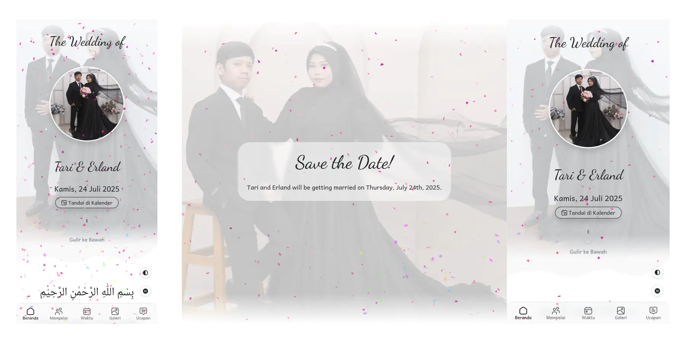
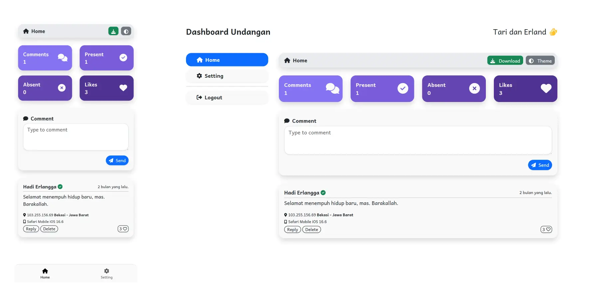
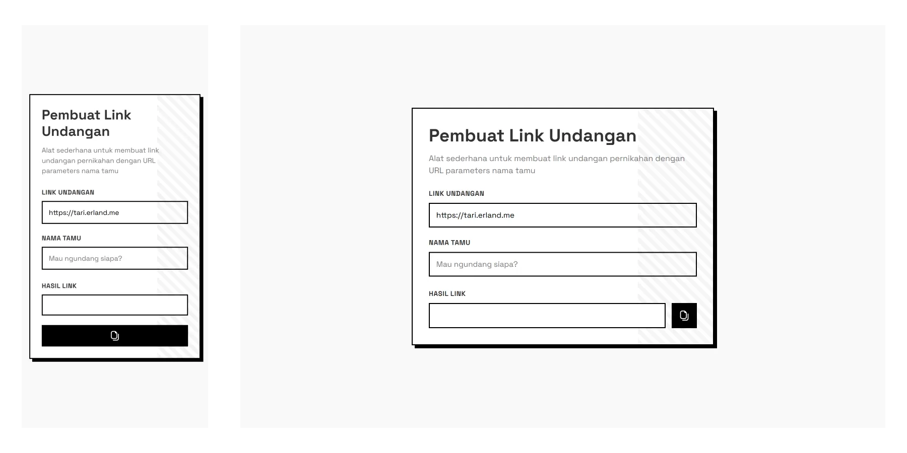
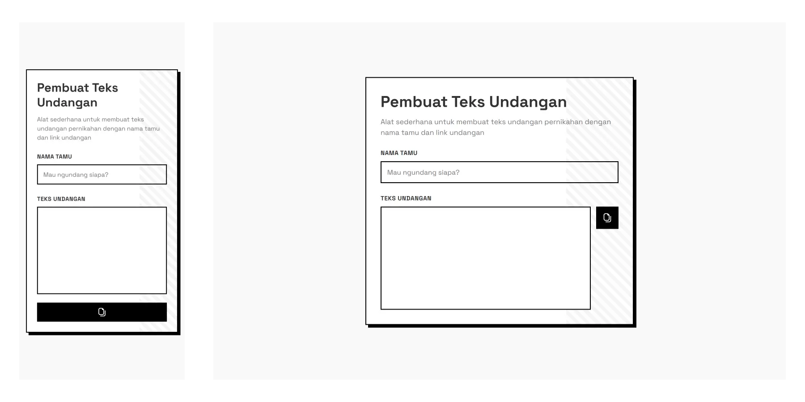

# Undangan Pernikahan Digital
Website undangan digital dengan Dashboard, Link Generator, dan Text Generator.
Frontend dibangun menggunakan Bootstrap, AOS, Fontawsome, Normalize, Confetti, Google Fonts, dan Vanilla JS.

## Preview
Preview undangan digital, dashboard undangan, link generator, dan text generator.

### Undangan
Undangan pernikahan digital dengan tampilan dan fitur yang sederhana.
[https://tari.erland.me/?to=Sahabatku](https://tari.erland.me/?to=Sahabatku)

### Dashboard
Dashboard untuk mengelola ucapan dan keterangan presensi dari para tamu undangan.
[https://tari.erland.me/dashboard](https://tari.erland.me/dashboard)

### Link Generator
Alat sederhana untuk membuat link undangan pernikahan dengan URL parameters nama tamu.
[https://tari.erland.me/link-generator](https://tari.erland.me/link-generator)

### Text Generator
Alat sederhana untuk membuat teks undangan pernikahan dengan nama tamu dan link undangan.
[https://tari.erland.me/text-generator](https://tari.erland.me/text-generator)

## License
[Undangan Digital](https://github.com/erlandv/undangan-digital) is open-sourced software licensed under the [MIT license](https://opensource.org/licenses/MIT).

## Credit
Created by [dewanakl](https://github.com/dewanakl), modified by [erlandv](https://github.com/erlandv). For documentation please refer to the original repository: [https://github.com/dewanakl/undangan](https://github.com/dewanakl/undangan).